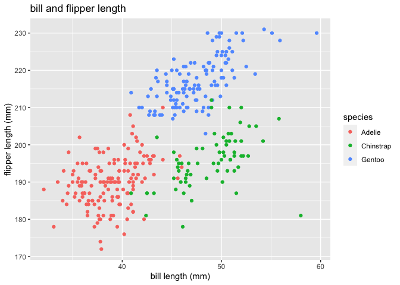

Homework 1
================
Amanda Warnock

This is my solution to HW1.

``` r
library(tidyverse)
```

    ## ── Attaching packages ──────────────────────────────────────── tidyverse 1.3.0 ──

    ## ✓ ggplot2 3.3.2     ✓ purrr   0.3.4
    ## ✓ tibble  3.0.3     ✓ dplyr   1.0.2
    ## ✓ tidyr   1.1.2     ✓ stringr 1.4.0
    ## ✓ readr   1.3.1     ✓ forcats 0.5.0

    ## ── Conflicts ─────────────────────────────────────────── tidyverse_conflicts() ──
    ## x dplyr::filter() masks stats::filter()
    ## x dplyr::lag()    masks stats::lag()

## Problem 1

Create a data frame with the specified elements.

``` r
prob1_df =
  tibble(
    samp = rnorm(10),
    samp_gt_0 = samp > 0,
    char_vec = c("a", "b", "c", "d", "e", "f", "g", "h", "i", "j"),
    factor_vec = factor(c("low", "low", "low", "mod", "mod", "mod", "mod", "high", "high", "high"))
)
```

Take the mean of each variable in my data frame.

``` r
mean(pull(prob1_df, samp))
```

    ## [1] -0.2461873

``` r
mean(pull(prob1_df, samp_gt_0))
```

    ## [1] 0.3

``` r
mean(pull(prob1_df, char_vec))
```

    ## Warning in mean.default(pull(prob1_df, char_vec)): argument is not numeric or
    ## logical: returning NA

    ## [1] NA

``` r
mean(pull(prob1_df, factor_vec))
```

    ## Warning in mean.default(pull(prob1_df, factor_vec)): argument is not numeric or
    ## logical: returning NA

    ## [1] NA

I can take the mean of numbers and logical, but not character or factor.

``` r
as.numeric(pull(prob1_df, samp))
```

    ##  [1] -0.05017896  1.35956551 -0.70782509 -0.23560204  0.69464931  0.67156009
    ##  [7] -1.57059969 -1.64420838 -0.95830296 -0.02093031

``` r
as.numeric(pull(prob1_df, samp_gt_0))
```

    ##  [1] 0 1 0 0 1 1 0 0 0 0

``` r
as.numeric(pull(prob1_df, char_vec))
```

    ## Warning: NAs introduced by coercion

    ##  [1] NA NA NA NA NA NA NA NA NA NA

``` r
as.numeric(pull(prob1_df, factor_vec))
```

    ##  [1] 2 2 2 3 3 3 3 1 1 1

I can convert the sample numbers and logical vector to numeric, which is
why the mean worked. I cannot convert the character vector, which is why
it didn’t work. I can convert the factor vector, but not in a way that
is meaningful yet.

Below, I convert the logical vector to numeric and multiply the random
sample by the result.

``` r
as.numeric(pull(prob1_df, samp_gt_0)) * pull(prob1_df, samp)
```

    ##  [1] 0.0000000 1.3595655 0.0000000 0.0000000 0.6946493 0.6715601 0.0000000
    ##  [8] 0.0000000 0.0000000 0.0000000

Below, I convert the logical vector to a factor and multiply the random
sample by the result. This does not work.

``` r
as.factor(pull(prob1_df, samp_gt_0)) * pull(prob1_df, samp)
```

    ## Warning in Ops.factor(as.factor(pull(prob1_df, samp_gt_0)), pull(prob1_df, : '*'
    ## not meaningful for factors

    ##  [1] NA NA NA NA NA NA NA NA NA NA

Below, I convert the logical vector to a factor and then convert the
result to numeric, and then multiply the random sample by the result.
This now works.

``` r
as.numeric(as.factor(pull(prob1_df, samp_gt_0))) * pull(prob1_df, samp)
```

    ##  [1] -0.05017896  2.71913102 -0.70782509 -0.23560204  1.38929862  1.34312018
    ##  [7] -1.57059969 -1.64420838 -0.95830296 -0.02093031

## Problem 2

I have installed the package containing penguins dataset. I will now
load the penguins dataset.

Some important variables in this dataset include species, island,
bill\_length\_mm, bill\_depth\_mm, flipper\_length\_mm, body\_mass\_g,
sex, year. The penguin datset has 344 rows and 8 columns. The mean bill
length is 43.9mm and the mean bill depth is 17.2mm. The mean flipper
length is 200.9mm. The mean body mass is 4201.8g.

The species included are Adelie, Gentoo, Chinstrap. The years included
are 2007, 2008, 2009. The islands included are Torgersen, Biscoe, Dream.

Below is a scatter plot comparing bill length (mm) and flipper length
(mm).

``` r
plot_df = tibble(
  x = penguins$bill_length_mm,
  y = penguins$flipper_length_mm,
  species = penguins$species
)

ggplot(data = plot_df, 
       aes(x = x, 
           y = y, 
           color = species)) + geom_point() + 
      labs(title = "bill and flipper length", 
           x = "bill length (mm)", 
           y = "flipper length (mm)") 
```

    ## Warning: Removed 2 rows containing missing values (geom_point).

<!-- -->
